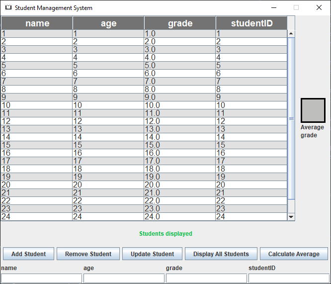

<a name="readme-top"></a>

<br />
<div align="center">
  <a href="https://www.selenium.dev/">
    
  </a>

  <h3 align="center">Student Management System</h3>

  <p align="center">
    Application for managing student information.
    <br />
    <a href="https://ypanator.github.io/SMS-school-project/doc/allclasses-index.html"><strong>Explore the docs »</strong></a>
    <br />
    <br />
  </p>
</div>

<details>
  <summary>Table of Contents</summary>
  <ol>
    <li><a href="#installation">Installation</a></li>
    <li><a href="#usage">Usage</a></li>
  </ol>
</details>

## Installation
*commands are for Windows CMD*

1. Clone the repository.

   ```
   git clone https://github.com/ypanator/SMS-school-project.git
   ```

2. Navigate to the project folder.

   ```
   cd "sms school project\SMS-school-project"
   ```

3. Compile the application.

   ```
   javac -d bin -sourcepath src -cp db\* src\smsapp\Main.java
   ```

4. Run the application.

   ```
   java -cp bin;db\* smsapp.Main
   ```

<p align="right">(<a href="#readme-top">back to top</a>)</p>

## Usage

<p align="center"></p>

<ul>
    <li>To add a student, fill in all text fields at the bottom and press the "Add Student" button</li>
    <li>To remove a specific student, provide the studentID and press the "Remove Student" button</li>
    <li>To update specific student's data, fill in all text fields at the bottom and press the "Update Student" button</li>
    <li>To display saved students, press the the "Display All Students" button</li>
    <li>To calculate the average grade across all saved students, press the the "Calculate Average" button</li>
</ul>
<em>Please note: the displayed student data isnt automatically updated. To see the newest data press the <strong>"Display All students"</strong> button.</em>

<p align="right">(<a href="#readme-top">back to top</a>)</p>